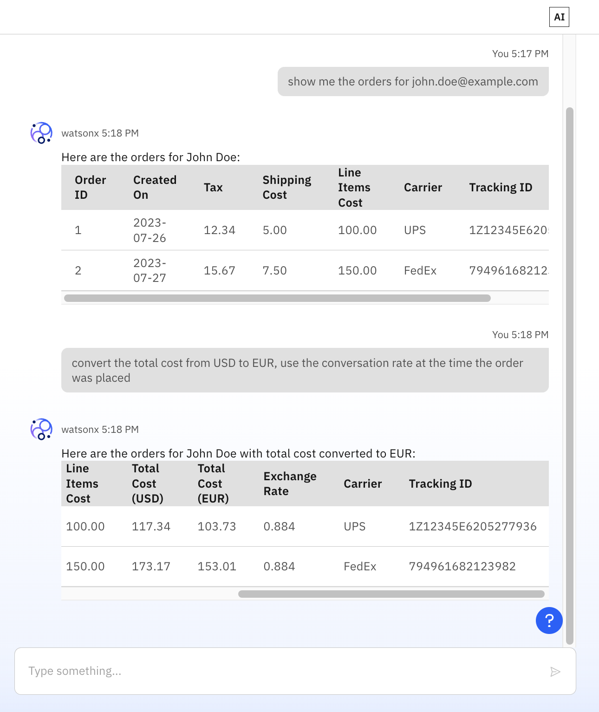

# Building AI Agents with watsonx.ai Flows Engine

In this tutorial you'll learn how to build AI Agents using watsonx.ai Flows Engine, a framework for building AI applications by IBM. By the end of this tutorial, you’ll know how to create domain-specific AI agents that can help automate tasks and solve real-world problems in your applications. Flows Engine makes it easy to get started building AI applications for everyone, whether you’re a data scientist, a developer, or just curious about how AI agents work.



## Before you begin

*You need to have Python and Node.js installed on your machine.*

- Sign up for a **free** [watsonx.ai Flows Engine account](https://ibm.biz/wxflows)
- Install the API Connect Essentials CLI (`npm i -g stepzen`)
- Install the watsonx.ai Flows Engine CLI (https://wxflows.ibm.stepzen.com/docs/installation)
- Authenticate to watsonx.ai Flows Engine (https://wxflows.ibm.stepzen.com/docs/authentication)

## Building AI Agents step-by-step

We’ll build three domain-specific AI agents: Customers, Orders, and Exchange Rates. Each of these agents will be powered by a different data source, in the form of a REST API or Database. The Customers agent will help manage and analyze customer data, answering queries about customer profiles, purchase history, and segmentation. The Orders agent will automate tasks related to tracking and managing orders, providing real-time insights on order status, fulfillment, and shipment details. Lastly, the Exchange Rates agent will assist in retrieving and converting currency exchange rates, helping you keep up-to-date with real-time financial data. Together, these agents will demonstrate how AI can streamline business operations across multiple domains.

In the next sections we'll convert data sources into an endpoint that can be exposed as an agent.

### Create endpoint for Customers Agent

In this section, we'll set up a Customers API endpoint that allows you to retrieve customer data based on specific search criteria like email. Using [API Connect Essentials](https://dashboard.ibm.stepzen.com/), we'll import a REST API and expose it as an agent endpoint, making it easy to query customer details.

1. Create and navigate to the directory:

  ```bash
  mkdir customers && cd customers
  ```

2. Initialize the project:

  ```bash
  stepzen init --endpoint=api/basicdemo-customers
  ```

3. Import the data source (REST API):

  ```bash
  stepzen import curl "https://json2api-customers-zlwadjbovq-uc.a.run.app/customers?q=email+eq+john.doe@example.com" --query-name=customerBySearchQuery --query-type=Customer --name=customer
  ```

4. Run the following command to create the `config.yaml` file to make the endpoint public:

  ```bash
  echo "access:
    policies:
      - type: Query
        policyDefault:
          condition: \"true\"" >> config.yaml
  ```

5. Deploy the endpoint:

  ```bash
  stepzen deploy
  ```

With these steps, you've now created a public API endpoint that fetches customer data. This setup will serve as a foundation for other domain-specific agents we’ll build in the tutorial, making data retrieval simpler and more efficient.

### Create endpoint for Orders Agent

In this section, we’ll set up an Orders API endpoint that will allow the Orders agent to access and retrieve data from a MySQL database. Using [API Connect Essentials](https://dashboard.ibm.stepzen.com/), we’ll connect the MySQL database and expose it as an agent endpoint, making it easy to manage and query order details.

1. Create and navigate to the directory:

  ```bash
  cd ../

  mkdir orders && cd orders
  ```

2. Initialize the project:

  ```bash
  stepzen init --endpoint=api/basicdemo-orders
  ```

3. Import the MySQL data source:

  ```bash
  stepzen import mysql --non-interactive --db-database=valle --db-host=35.224.227.100 --db-user=testuservalle --db-password=GlueChompUntaintedTattered1022
  ```

4.  Run the following command to edit the `config.yaml` file to make the endpoint public:

  ```bash
  echo "access:
    policies:
      - type: Query
        policyDefault:
          condition: \"true\"" >> config.yaml
  ```

5. Deploy the endpoint:

  ```bash
  stepzen deploy
  ```

By completing these steps, you’ve now created a public API endpoint for orders that connects directly to your MySQL database. This endpoint will be the backbone for the Orders agent, allowing access to order data for your applications.

### Create an endpoint for Exchange Agent

In this section, we’ll create an Exchange API endpoint that allows the Exchange agent to access real-time currency conversion rates using a REST API. By integrating with [API Connect Essentials](https://dashboard.ibm.stepzen.com/), we’ll expose this data as an agent endpoint, enabling currency conversions within your applications.

1. Create and navigate to the directory:

  ```bash
  cd ../

  mkdir exchange && cd exchange
  ```

2. Initialize the project:

  ```bash
  stepzen init --endpoint=api/basicdemo-exchange
  ```

3. Import the data source (REST API):

  ```bash
  stepzen import curl 'https://api.frankfurter.app/2023-09-27?amount=10&from=GBP&to=USD' --query-name exchangeRates --query-type Rates --name exchange --path-params='/$date'
  ```

4. **Edit** `exchange/index.graphql`:
  One of the upsides of using API Connect Essentials to create the agent endpoints, is being able to modify or curate the data that's being returned so it becomes easier for the LLM to interpret the data. Modify the `rates` field to return the response type as `JSON`:

  ```graphql
  type Rates {
    amount: Int
    base: String
    date: Date
    rates: JSON # Modify this line
  }
  ```

5. Run the following command to create the `config.yaml` file to make the endpoint public:

  ```bash
  echo "access:
    policies:
      - type: Query
        policyDefault:
          condition: \"true\"" >> config.yaml
  ```

6. Deploy the endpoint:

  ```bash
  stepzen deploy
  ```

With this setup, you’ve successfully created a public API endpoint for currency exchange rates. This endpoint will empower the Exchange agent to perform real-time conversions, helping you stay up to date with currency fluctuations across different markets.

## Create the meta agent

Now that we’ve set up individual endpoints for customers, orders, and exchange rate agents, it's time to bring them together into a meta agent. This meta agent will integrate all three endpoints, allowing a single API to handle customer queries, order tracking, and currency conversions seamlessly. Let's get started by importing these agents and deploying the unified endpoint.

1. Move to the root directory:

  ```bash
  cd ../
  ```

2. Authenticate to your LLM provider. You can use either OpenAI or watsonx.ai; only credentials for one of the two are needed:

  - **OpenAI:** In the terminal, set your OpenAI API key:

    ```bash
    export STEPZEN_OPENAI_API_KEY=
    ```
  
  - **IBM watsonx.ai:** In the terminal, run the following commands with your Watsonx.ai credentials:

    ```bash
    export STEPZEN_WATSONX_HOST=us-south.ml.cloud.ibm.com
    export STEPZEN_WATSONX_PROJECTID=
    export STEPZEN_WATSONX_AI_TOKEN=
    ```

    To find your credentials:

    - `STEPZEN_WATSONX_PROJECTID`: Get this from the *Manage* tab in your project.
    - `STEPZEN_WATSONX_AI_TOKEN`: Create an API key in IBM Cloud under *Manage > Access (IAM) > API keys*.

3. **Register the endpoints as agents** using the following command to register each endpoint and describe its functions:

  ```bash
  wxflows init --endpoint-name api/basicdemo-agents \
  --import-name customers  --import-url api/basicdemo-customers \
    --import-tool-name customers --import-tool-description "Retrieve customer information. You can get customer details if you have the email by defining the value for 'q' like this 'email eq john.doe@example.com'. And this works for other fields like city too." --import-tool-fields "customerBySearchQuery" \
  --import-name orders  --import-url api/basicdemo-orders --import-prefix "MYSQL_"  \
    --import-tool-name orders --import-tool-description "Retrieve order information for customers" \
  --import-name exchange  --import-url api/basicdemo-exchange \
    --import-tool-name exchange --import-tool-description "Convert currency, supports historical rates" --import-tool-fields "exchangeRates"
  ```

  The above command will import the three endpoints as agents, adds name and description for the tools they contain, and defines the field(s) from the API that are used.

4. Deploy the meta agent using the generated `wxflows.toml` file with:

  ```bash
  wxflows deploy
  ```

  This will return an endpoint URL, which you can use for further application development in the next section.

### Run the Chat Application

Now that we’ve created the meta agent, it’s time to see it in action by building a simple chat application. This application will interact with the meta agent to retrieve customer data, manage orders, and convert currencies—all through natural language queries.

1. Navigate to the `demo-app` directory and install dependencies:

  ```bash
  cd demo-app
  npm i
  ```

2. Add your meta agent endpoint and API key. Open the `.env` file and add the following:

  ```bash
  VITE_WXFLOWS_ENDPOINT=
  VITE_WXFLOWS_APIKEY=
  VITE_WXFLOWS_AI_ENGINE=
  ```

  To retrieve your API Key you can run the command `wxflows whoami --apikey` in your terminal. The value for `VITE_AI_ENGINE` is either `openai` or `wx` (for watsonx.ai).

3. Start the application:

  ```bash
  npm run dev
  ```

4. Access the app in your browser:
  Open your browser and go to `http://localhost:5174/`. (Note: the actual port may vary, so check the terminal output for the correct port).

5. Test the application with the following sample questions:

  - *"Show me the orders for john.doe@example.com"* (Uses both the customers and orders agents).
  - *"Convert the total cost from USD to EUR, using the exchange rate at the time the order was placed"* (Uses the exchange rates agent).

## Where to go from here

In this tutorial, we learned how to build AI agents using watsonx.ai Flows Engine. We created three agents: one for customer data, one for managing orders from a MySQL database, and another for currency exchange rates. Then, we combined them into a meta agent that handles all three in one place. Finally, we used this meta agent in a simple chat application to answer questions about customers, orders, and currency conversions. This showed how you can use AI to easily connect different data sources and automate tasks.

Using API Connect Essentials you can turn any data source into an endpoint suitable to be used in the watsonx.ai Flows Engine agent framework. After importing a data source using the CLI (`stepzen import ...`) you can alter the generated API schema to make it easier to use for the LLM.

Join our [Discord channel](https://ibm.biz/wxflows-discord) to learn more about watsonx.ai Flows Engine and building AI applications with IBM.

