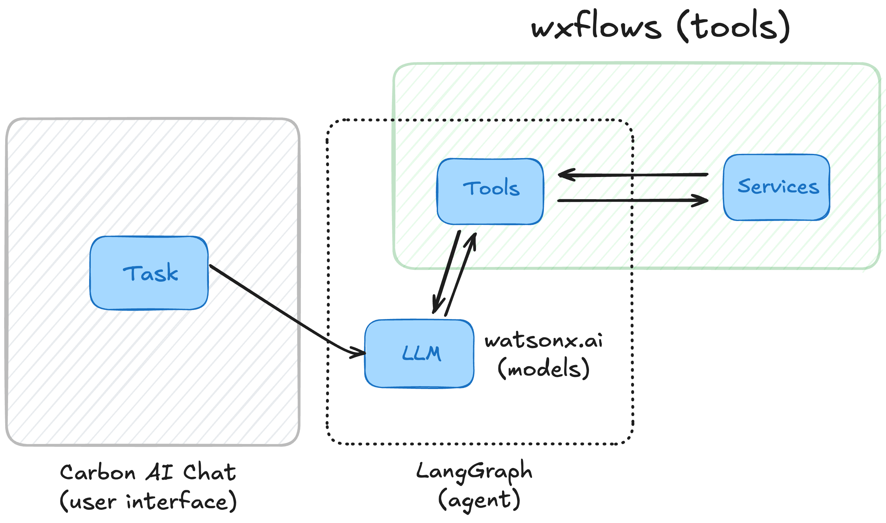

# Using watsonx.ai Flows Engine in a Chat Application

Here's a step-by-step tutorial for setting up and deploying an AI Agent with `wxflows` and LangGraph, including installing necessary tools, deploying the app, and running it locally.



This example consists of the following pieces:

- LangGraph SDK (agent)
- watsonx.ai (models)
- wxflows SDK (tools)
- Carbon AI Chat (user interface)

> You can use any of the [supported chat models](https://js.langchain.com/docs/integrations/chat/).

This guide will walk you through installing the `wxflows` CLI, initializing and deploying a project, and running the application locally. We’ll use `google_books` and `wikipedia` tools as examples for tool calling with `wxflows`.

## Before you start

Clone this repository and open the right directory:

```bash
git clone https://github.com/IBM/wxflows.git
cd examples/chat-app
```

## Step 1: Set up wxflows

Before you can start building AI applications using watsonx.ai Flows Engine:

1. [Sign up](https://ibm.biz/wxflows) for a free account
2. [Download & install](https://wxflows.ibm.stepzen.com/docs/installation) the Node.js CLI
3. [Authenticate](https://wxflows.ibm.stepzen.com/docs/authentication) your account

## Step 2: Deploy a Flows Engine project

Move into the `wxflows` directory:

```bash
cd wxflows
```

There's already a wxflows project for you set up this repository with the following values:

- **Defines an endpoint** `api/examples-chat-app` for the project.
- **Imports `google_books` tool** with a description for searching books and specifying fields `books|book`.
- **Imports `wikipedia` tool** with a description for Wikipedia searches and specifying fields `search|page`.

You can deploy this tool configuration to a Flows Engine endpoint by running:

```bash
wxflows deploy
```

This command deploys the endpoint and tools defined, these will be used by the `wxflows` SDK in your application.

## Step 3: Install Dependencies in the Application

To run the application you need to install the necessary dependencies:

```bash
cd ../
npm i
```

This command installs all required packages, including the `@wxflows/sdk` package and any dependencies specified in the project.

## Step 4: Set Up Environment Variables

Copy the sample environment file to create your `.env` file:

```bash
cp .env.sample .env
```

Edit the `.env` file and add your credentials, such as API keys and other required environment variables. Ensure the credentials are correct to allow the tools to authenticate and interact with external services.

## Step 5: Run the Application

Finally, start the application by running:

```bash
npm run dev
```

This command initiates your application, allowing you to call and test the `google_books` and `wikipedia` tools through `wxflows`.

## Summary

You’ve now successfully set up, deployed, and run a `wxflows` project with `google_books` and `wikipedia` tools. This setup provides a flexible environment to leverage external tools for data retrieval, allowing you to further build and expand your app with `wxflows`. See the instructions in [tools](../../tools/README.md) to add more tools or create your own tools from Databases, NoSQL, REST or GraphQL APIs.
